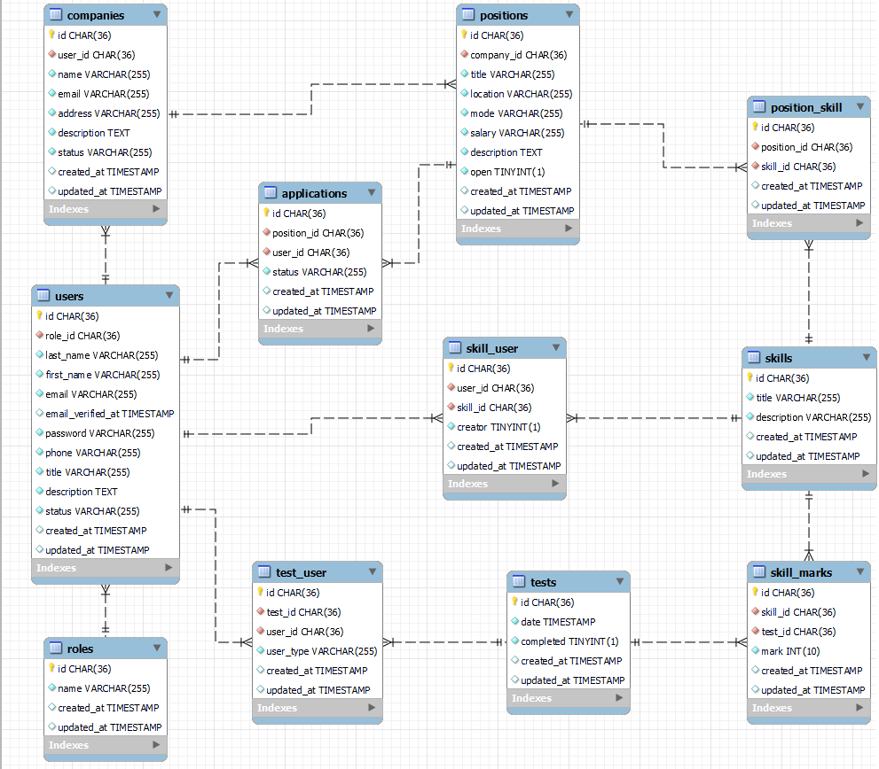
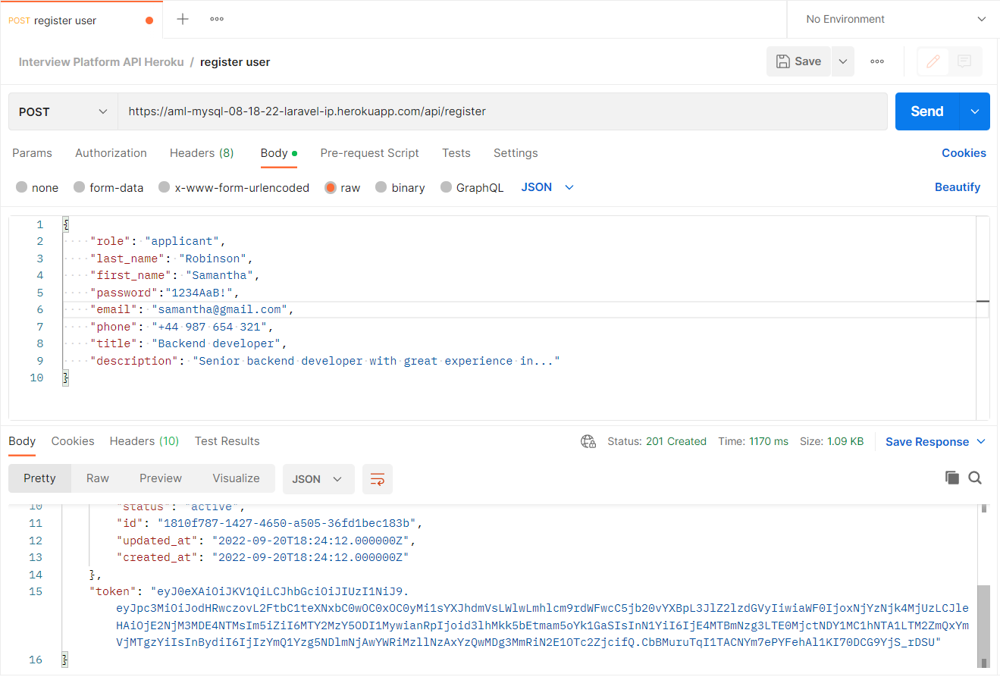
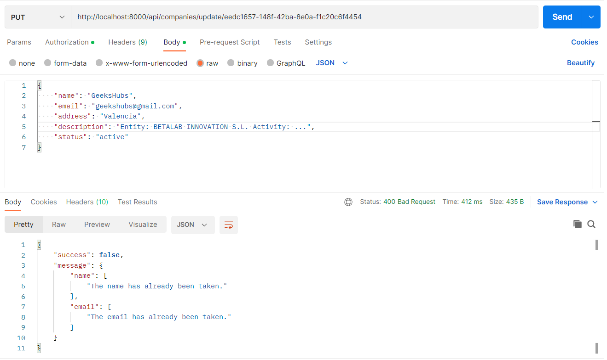
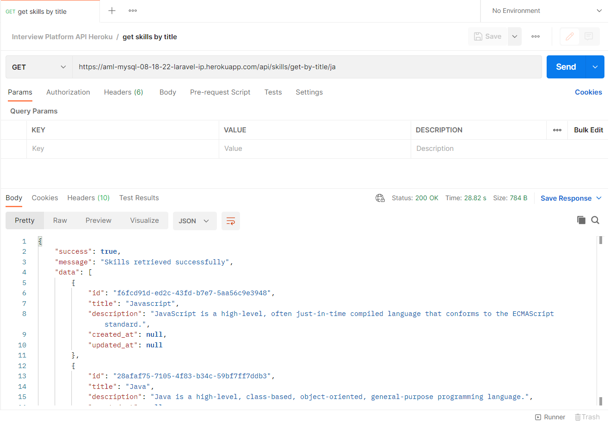
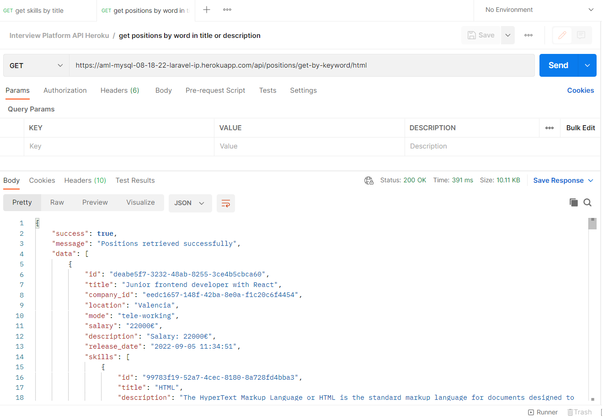
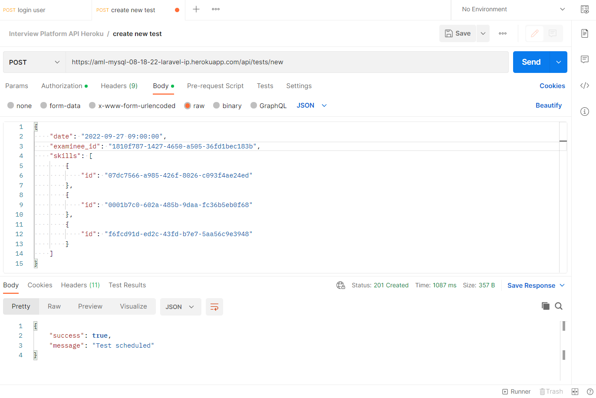

 

<h2> PROYECTO FINAL GEEKSHUBS PARTE DE BACKEND: PLATAFORMA PARA ENTREVISTAS TÉCNICAS </h2>

#### Definición y alcance:

El objeto de este proyecto con fines de formación, el séptimo y último de los que realizamos durante el bootcamp "Full Stack Developer" en GeeksHubs, es una aplicación web completa y consta a su vez de dos partes: esta es la parte de backend, que será una API REST que proveerá de contenidos a la otra parte de frontend.  
 
El background es el que sigue:  
Una empresa tecnológica quiere crear un sistema de registro de las entrevistas técnicas que realizan cuando contratan candidatos. El rol de los usuarios de Recursos Humanos es el de crear posiciones a las cuales los candidatos se pueden apuntar. Posteriormente, estos candidatos realizan una prueba técnica y su resultado se almacena, junto con la fecha de realización de la misma. Finalmente, se realiza una entrevista técnica en la cual se puntúan diferentes habilidades de los candidatos.  

Los requisitos funcionales mínimos de la aplicación son los siguientes:  
● Los usuarios se tienen que poder registrar a la aplicación, estableciendo un usuario/contraseña.  
● Los candidatos tienen que autenticarse a la aplicación haciendo login.  
● Los usuarios de Recursos Humanos tienen que autenticarse a la aplicación haciendo login.  
● Los usuarios tienen que poder hacer logout de la aplicación web.  
● Los usuarios de Recusos Humanos tienen que poder crear posiciones. Las posiciones tienen, como mínimo, un título y una descripción.  
● Los candidatos tienen que poder buscar posiciones por partes de su título o descripción.  
● Los candidatos tienen que poder apuntarse a una posición.  
● Los usuarios de HR tienen que poder informar de la fecha de realización y el resultado de las pruebas técnicas que realicen los candidatos.  
● Los usuarios de HR tienen que poder crear, modificar y borrar Skills (habilidades).  
● Los usuarios de HR tienen que poder buscar Skills.  
● Los usuarios de HR tienen que poder valorar un candidato con un conjunto de Skills y puntuación de las mismas.  
● Además, se dispondrá de un CRUD de usuario con las operaciones básicas.  

#### API-REST: Tecnologías aplicadas:

Necesario: PHP, Laravel, SQL, MySQL, jsonwebtoken, bcript.  
Muy recomendado: MySQL Workbench, Postman. 

#### Objetivos:

1- En el presente proyecto del Bootcamp Full Stack correspondiente a la parte de backend se espera que el alumno demuestre todos los conocimientos adquiridos en las tecnologías escogidas (en este caso, PHP + Laravel).  
2- El alumno ha de realizar una API REST completa con Laravel que cumpla con los requisitos del proyecto.  
3- Realizar un CRUD de los diferentes modelos.  
4- Login de usuarios + token + middleware, con Middleware para los roles de usuario.  
5- Al menos una relación Many to Many y otra One to Many.  
6- Seeders para las diferentes tablas.  
7- Aplicación de buenas prácticas, principios SOLID (especialmente el principio de responsabilidad única).  
8- Despliegue en heroku.com.  

#### Estructura de la base de datos:

Para definir la lógica de la aplicación se han seguido las siguientes pautas:  
- El diseño de la aplicación gira en torno a los dos roles de usuario y las operaciones que pueden realizar:
- Un usuario de recursos humanos (recruiter) puede registrar las compañías para las que va a reclutar, así como habilidades (skills) nuevas que solo él podrá editar o borrar mas adelante. Posteriormente, puede publicar ofertas de empleo (positions) para estas compañías, con una lista de las habilidades requeridas (position_skill). Por simplicidad, se ha acotado a un solo usuario autorizado por compañía, aunque esto es muy ampliable.
- Un usuario de tipo candidato (applicant) puede editar su perfil para incluir, a parte de su información personal y profesional, una lista con todas las habilidades registradas que considera que sabe usar (skill_user). A parte, puede presentar su candidatura (applications) para las ofertas (positions) que considere.
- El recruiter puede entonces ver la información de los aspirantes que han presentado sus candidaturas para cada puesto y notificarles la fecha de realización de una prueba / entrevista técnica (tests). Posteriormente, podrá publicar los resultados de dicha prueba para cada habilidad que haya evaluado (skill_marks), datos que cada aspirante podrá también consultar en su perfil.

Teniendo en cuenta los requisitos antes mencionados, se ha dispuesto que la base de datos será relacional de tipo SQL y contará con 11 tablas / modelos, a saber:  
    ● User, con los datos personales de los usuarios.  
    ● Skills, con el título y una breve descripción de cada habilidad.  
    ● Roles, con los dos tipos de usuario de los que dispondrá la web de momento, véase 'applicant' y 'recruiter', que disfrutarán de distintos grados de acceso a las funcionalidades de la web. Por brevedad, no se ha dispuesto por ahora de un rol de administrador.  
    ● Skill_user, la tabla intermedia que indicará las habilidades que cada usuario declara que sabe manejar.  
    ● Positions, que representa la información de cada puesto de trabajo ofertado.  
    ● Position_skill, tabla intermedia que contiene las habilidades requeridas para cada oferta.  
    ● Companies, tabla con información sobre la empresa para la que se publica cada oferta.  
    ● Applications, tabla con información sobre los usuarios implicados en cada oferta de empleo y la situación de su candidatura.  
    ● Tests, que recoge fecha y estado de cada prueba técnica.  
    ● Test_user, con registros del examinador y el examinado para cada prueba técnica.  
    ● Skill_mark, las habilidades que serán evaluadas en cada test y su resultado una vez evaluadas.  

 

#### Instrucciones de uso:

● Si se desea clonar el proyecto en un repositorio local:

1- Clonar este proyecto en nuestro repositorio local. Desde consola:  
    git clone https://github.com/AntonioML-sc/Interview-platform-api.git  

2- Instalar las dependencias necesarias incluidas en package.json:  
    composer install  

3- Crear nuestra base de datos en local usando MySQL Workbench (recomendado).  

4- En la carpeta raíz del proyecto encontraremos un archivo llamado .env.example. Copiarlo y renombrarlo como .env. A continuación, debemos editar los tres primeros grupos de variables, en los que indicaremos los datos de la base de datos que acabamos de crear.  

5- En la consola, ejecutar el comando:  
    php artisan jwt:secret  

6- Como consecuencia del paso 5, ahora tendremos una línea nueva en nuestro archivo .env, que incluye la clave de jwt con un valor aleatorio. Se puede editar esta clave si se desea.  

7- Migrar los modelos a la base de datos local:  
    php artisan migrate  

8- Crear los registros necesarios para los roles de usuario en la base de datos usando seeders. Se crean con unos id determinados, de modo que se garantice que los métodos de autentificación que los usan funcionen correctamente:  
    php artisan db:seed  

9- Ejecutar el comando que levantará el servidor:  
    php artisan serve  

Ahora ya podemos realizar peticiones a través de los endpoints (recomendado Postman o la extensión thunder en visual studio code o bien clonar también la parte frontend de este proyecto).  

● Si solo se desea probar la api ya desplegada en heroku, la dirección es:  
    https://aml-mysql-08-18-22-laravel-ip.herokuapp.com/api  
SE RUEGA USARLA CON GENTILEZA.  

#### Listado de endpoints:

Dentro del proyecto, las rutas para todos los endpoints y sus requisitos de autenticación se encuentran en el archivo routes/api.php.   

Si se usa en local, la raíz de las url es por defecto: http://localhost:8000/api  

1- Auth:  

- POST /register => Crea un nuevo usuario. Se deben pasar por body, en formato json, nombre, apellidos, teléfono, email, password, un título que describa la profesión y una descripción ampliada. Estos campos deben tener un formato válido y el email no puede estar ya registrado. Si pasa la validación, se creará el nuevo usuario y se facilitarán los datos del nuevo registro y el token para acceder a las funciones que requieren autenticación.  

 

- POST /login => Login de usuario, pasando por body email y password. Si las credenciales son válidas, se proveerá del token necesario para acceder al resto de funciones que exijan autenticación. Para acceder a las funciones que exijan ser admin (o super admin), es necesario que el ese usuario tenga un registro en la tabla role_user en que se le asigna el rol correspondiente.  

- GET /my-profile => (con autenticación) Muestra los datos del perfil del usuario que haya hecho login, incluyendo información de otras tablas como sus skills, applications, companies y tests  
- POST /logout => (con autenticación) Logout del usuario. Las funciones que exijan autenticación dejarán de estar accesibles.  
- PUT /my-profile/update => (con autenticación) Permite que un usuario modifique algunos de los datos de su cuenta, así como su lista de habilidades.  
- DELETE /my-profile/delete => (con autenticación) Borrado lógico del registro del usuario, ajustando la columna status.  

2- User:  

- GET /users/get-all => Muestra los datos de todos los usuarios registrados.  
- GET /users/get-by-skill/{word} => Busca usuarios con una skill con nombre como la palabra de búsqueda.  

3- Company:  

- GET /companies/get-all => Muestra los datos de todas las empresas activas registradas.  
- GET /companies/get-by-name/{name} => Busca empresas por su nombre.  
- GET /companies/get-my-companies => (solo recruiter) Busca las empresas registradas por el recruiter que haya hecho login.  
- POST /companies/new => (solo recruiter) Registra una nueva empresa en la base de datos, con los campos definidos por body. El nombre y el email deben ser únicos.  
- PUT /companies/update/{companyId} => (solo recruiter) Modifica los datos de una empresa ya registrada, con los campos definidos por body. El título debe ser único. Solo puede ser llevado a cabo por el recruiter que registró la empresa. Los nuevos datos también deben ser válidos, con el nombre y email únicos. También actúa como borrado lógico, estableciendo el status como 'deleted'. 

 

4- Skill:  

- GET /skills/get-all => Recupera todas las habilidades con su nombre y descripción.  
- GET /skills/get-by-title/{title} => Busca habilidades por nombre.  

 

- POST /skills/new => (solo recruiter) Registra una nueva skill. Se toma el id del usuario que lo creó, y crea un registro en skill_user como creador de la habilidad, siendo el único usuario que podrá modificarla o borrarla.  
- PUT /skills/update/{skillId} => (con autenticación) Modifica los datos de una skill. Solo puede ser llevado a cabo por el usuario que la registró.  
- DELETE /skills/delete/{skillId} => (con autenticación) Elimina por completo una skill (borrado físico). Solo puede ser llevado a cabo por el usuario que registró la skill.  

5- Position:  

- GET /positions/get-all => Muestra todas las ofertas de empleo (positions) disponibles que aún estén abiertas, junto con sus habilidades requeridas, información de la empresa y de los aspirantes que han aplicado a cada una.  
- GET /positions/get-by-id/{positionId} => Recupera la información de la oferta cuya id se pasa por url  
- GET /positions/get-by-keyword/{word} => Búsqueda compleja de ofertas que recupera coincidencias con la palabra de búsqueda introducida por url en título, descripción, habilidades, nombre de la empresa y localización.  

 

- GET /positions/get-by-company/{companyId} => Muestra todas las ofertas de empleo (positions) de una empresa específica.  
- POST /positions/new => (con autenticación) Registra una nueva oferta de empleo. Cada recruiter solo puede registrar ofertas a nombre de las empresas que esté autorizado (en este caso, por simplicidad, solo de las que haya registrado).  
- POST /positions/attach-skill-list => (con autenticación) Añade una lista de skills a los requerimientos de una oferta de empleo.  
- POST /positions/detach-skill-list => (con autenticación) Elimina una lista de skills de los requerimientos de una oferta de empleo.  
- PUT /positions/update/{positionId} => (con autenticación) Permite al recruiter que publicó una oferta de empleo modificar algunos datos o darla por cerrada (actúa como un borrado lógico).  

6- Application:  

- GET /applications/my-applications => (con autenticación) Muestra todas las candidaturas del usuario que haya hecho login en ofertas de empleo (positions) ordenadas según su estado en el proceso.  
- GET /applications/get-by-position/{positionId} => (solo recruiter) Muestra todas las candidaturas para una oferta de trabajo concreta, de la que el usuario logueado debe ser administrador.  
- POST /applications/apply => (con autenticación) permite que un aspirante presente su candidatura a una oferta de empleo.  
- PUT /applications/reject-application/{applicationId} => (solo recruiter) Permite al recruiter que publicó una oferta de empleo rechazar una de las candidaturas que haya recibido.  

7- Test:  

- GET /tests/my-tests => (con autenticación) Muestra todos los test del usuario que haya hecho login, puntuados o no y ya sea examinador o examinado.  
- POST /tests/new => (solo recruiter) permite planificar un test para un aspirante, incluyendo la fecha, hora y el conjunto de habilidades que serán evaluadas.  

 

- POST /tests/attach-skill => (solo recruiter) permite añadir una skill a evaluar a un test ya existente.  
- POST /tests/detach-skill => (solo recruiter) permite remover una skill a evaluar de un test ya existente.  
- PUT /tests/evaluate-skill/{skillMarkId} => (solo recruiter) Permite al recruiter que programó un test a un aspirante evaluar una sola skill de dicho test.  
- PUT /tests/evaluate-test/{testId} => (solo recruiter) Permite al recruiter que programó un test evaluar varias o todas las skills de dicho test.  
- PUT /tests/evaluate-test/{testId} => (solo recruiter) Permite al recruiter que programó un test evaluar varias o todas las skills de dicho test.  
- DELETE /skills/delete/{skillId} => (solo recruiter) Permite al recruiter que programó un test eliminarlo del todo (borrado físico).
 

#### Bugs conocidos y posibles nuevos trabajos:

- Limpieza y optimización del código. Siempre hay algo que mejorar.  
- Otras peticiones que puedan ser convenientes, así como mejorar la información facilitada en algunas de las existentes.  
- Uso de servicios para no sobrecargar los controladores.  
- Reunir las variables de entorno en un único archivo.  
- Cualquier sugerencia será bien recibida.  

#### Créditos y agradecimientos:

- A los docentes y compañeros de GeeksHubs por la formación y el ánimo para seguir mejorando.  

#### Tecnologías:

<code></code>
<code></code>
<code></code>
<code></code>
<code></code>
<code></code>
